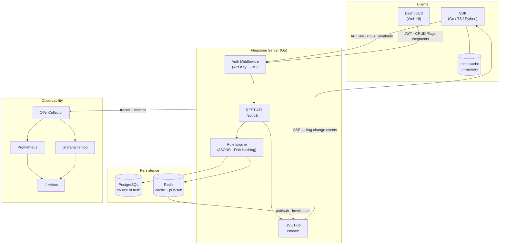

# Flagstone

> Self-hosted feature flag server with native OpenTelemetry observability. Built in Go.

[]()
[]()
[]()

---

## Table of Contents

- [What is Flagstone?](#what-is-flagstone)
- [The Problem](#the-problem)
- [Real-World Use Cases](#real-world-use-cases)
- [Why Flagstone?](#why-flagstone)
- [Architecture](#architecture)
- [Tech Stack](#tech-stack)
- [Features](#features)
- [Usage Examples](#usage-examples)
- [Authentication & Security](#authentication--security)
- [Infrastructure & Costs](#infrastructure--costs)
- [Roadmap](#roadmap)
- [Project Structure](#project-structure)
- [Local Development](#local-development)
- [Deploy to AWS](#deploy-to-aws)
- [Additional Docs](#additional-docs)
- [Contributing](#contributing)
- [License](#license)

---

## What is Flagstone?

Flagstone is a **feature flag** server (also known as feature toggles or feature switches). It lets you **enable or disable features in your application without deploying new code**, control which users see what, and run gradual rollouts or A/B tests from a central control plane.

Instead of hardcoding `if userIsBeta { ... }`, you write `if flagstone.IsEnabled("new-feature", user) { ... }` and the decision is made at runtime from a central server.

## The Problem

Every growing application hits the same walls:

1. **You want to test a feature with a small group** before releasing to everyone, but a separate branch or conditional deploy is costly and fragile.

2. **A new feature breaks production**, but a full deploy rollback reverts the 5 other things that shipped in that release. You need a granular kill switch.

3. **Premium features should only be visible to certain plans**, but hardcoding that logic across services leads to inconsistencies.

4. **You want a gradual rollout** (10% → 25% → 50% → 100%) to detect problems before they hit everyone.

5. **You need A/B testing** to decide between two implementations, but existing tools are expensive or tied to analytics products.

Current solutions have tradeoffs:

| Tool | Issue |
|---|---|
| **LaunchDarkly** | Excellent, but starts at ~$300 USD/month |
| **Unleash** | Open source but operationally heavy (TypeScript, many moving parts) |
| **Flagsmith** | Good, but self-hosted version lacks key SaaS features (Python) |
| **Flipt** | Closest competitor — also Go + OTel. Moved to Git-native config in v2, adding complexity for teams that want a simple API-first approach |
| **Roll your own** | You end up writing the same thing at every company |

**Flagstone targets the gap**: simple to deploy (one binary + Postgres), lightweight, with native OpenTelemetry observability, and powerful enough for 90% of real-world use cases. Compared to Flipt, Flagstone stays API-first with a traditional database backend rather than requiring Git-based configuration workflows.

## Real-World Use Cases

### Discord Music Bot

A bot that plays music in Discord servers. With Flagstone you can:

- **Enable features per server**: an `advanced-equalizer` flag active only for premium or test servers.
- **Gradual rollout of a new audio engine**: start with 5% of servers, monitor metrics, ramp up. If something breaks, drop to 0% instantly without a redeploy.
- **Kill switch for problematic commands**: if `/loop` causes memory leaks, disable it globally while you fix it, without taking down the entire bot.
- **Beta tester features**: a `beta-commands` flag that returns `true` only for a specific list of Discord user IDs.

```go
if flagstone.IsEnabled(ctx, "advanced-equalizer", flagstone.User{
    ID:   interaction.GuildID,
    Tier: "premium",
}) {
    return respondWithEqualizer(interaction)
}
return respondNormal(interaction)
```

### B2B SaaS

A web application with thousands of business customers:

- Release the new dashboard only to customers who opted into the beta program.
- Enable the Slack integration only for Enterprise plan customers.
- Roll out the new checkout flow to 1% of accounts, monitor conversion metrics, and ramp up gradually.

### Mobile App

An app you can't redeploy instantly (users take time to update):

- Kill switch for features that depend on a broken backend endpoint.
- Activate dark-launched features already in the code but not yet visible.
- Show different promotions by country without republishing the app.

### Internal Microservices

- A `use-redis-cache` flag the platform team can disable if Redis has issues, so services fall back to direct DB queries.
- Gradual migrations: a `write-to-new-table` flag controls whether services write to the old table, the new one, or both during a migration.

## Why Flagstone?

| Feature | Flagstone | LaunchDarkly | Unleash | Flagsmith | Flipt |
|---|---|---|---|---|---|
| Self-hosted | Yes | No | Yes | Yes (limited) | Yes |
| Open source | Yes | No | Yes | Yes | Yes |
| Setup < 5 min | Yes | Yes | No | Maybe | Yes |
| Native OTel observability | **Yes** | Partial | No | No | Yes |
| Real-time streaming | Yes (SSE) | Yes | Yes | Partial | Yes |
| Operational footprint | Low | N/A | High | Medium | Low |
| Config model | API-first | API | API | API | Git-native (v2) |
| Language | Go | ? | TypeScript | Python | Go |
| Cost | Free | $$$ | Free/$$$ | Free/$$$ | Free |

**The key differentiator is native observability**: every flag evaluation emits OpenTelemetry traces and metrics, letting you correlate flag changes with latency, errors, or user behavior changes from the same dashboard you already use (Grafana, Datadog, Honeycomb, etc.).

**Secondary differentiator: simplicity**. One binary, one Postgres, optional Redis. No Git workflows, no complex multi-service deployments.

## Architecture



### Visual overview

The [`diagrams/`](./diagrams/) folder contains a full architecture canvas exported from Excalidraw, covering the data model, auth flows, rule evaluation engine, pub/sub propagation, observability stack, AWS infrastructure, API design, and the complete SDK↔API sequence.

[](./diagrams/flagstone-overview.svg)

### Components

**Server (Go core)**: REST API, rule evaluation engine, SSE streaming, and persistence with Postgres + Redis. Authentication via hashed API keys (SDKs) and JWT sessions (dashboard).

**SDKs**: Lightweight client libraries. Cache evaluations locally, listen for changes via SSE streaming, and degrade gracefully if the server goes down. Priority languages: Go, TypeScript/JavaScript, Python.

**Dashboard web**: UI for creating flags, defining rules, viewing evaluations in real-time, and auditing changes.

**Storage**: PostgreSQL as source of truth. Redis for distributed cache and internal pub/sub between server instances.

> See [DESIGN.md](./DESIGN.md) for full architectural rationale and [SECURITY.md](./SECURITY.md) for the auth and threat model.

## Tech Stack

| Layer | Technology | Why |
|---|---|---|
| Server language | **Go 1.22+** | Cheap concurrency, static binaries, easy deploy |
| API | **HTTP/REST** | Simple, curl-able, debuggable. gRPC planned for v2 SDKs |
| Streaming | **Server-Sent Events** | Simpler than WebSockets, sufficient for unidirectional push |
| Storage | **PostgreSQL 16+** | ACID, JSONB for complex rules, ubiquitous |
| Cache | **Redis 7+** | Distributed cache + pub/sub for multi-instance coordination |
| Logging | **zap** (`go.uber.org/zap`) | High-performance structured logging in the eval hot path |
| Observability | **OpenTelemetry** | Standardized traces + metrics + logs |
| Web dashboard | **Next.js 15 + TypeScript** | Largest AI training-data corpus → best AI-assisted development |
| UI components | **shadcn/ui + Tailwind CSS** | Designer-quality components without being a designer |
| Containers | **Docker** (split: API + Web) | Independent build/scale, single `docker-compose.yml` for self-host |
| IaC | **Terraform** | Reproducible, versioned infrastructure |
| Cloud | **AWS** | Generous free tier + learning value |
| CI/CD | **GitHub Actions** | Community standard, free for OSS |
| Tests | **testify + testcontainers-go** | Unit tests + integration with real DB |
| Migrations | **golang-migrate** | Schema versioning |
| Standards | **OpenFeature** (planned) | CNCF standard for feature flag evaluation |

## Features

### Core (MVP)

- [ ] Boolean flags (on/off)
- [ ] User and attribute targeting
- [ ] Reusable segments
- [ ] Percentage-based rollout with consistent hashing
- [ ] Rules with AND/OR/NOT logic
- [ ] Per-environment overrides (dev/staging/prod)
- [ ] REST API + Go SDK
- [ ] JWT auth for dashboard, API key auth for SDKs
- [ ] Audit log (append-only, DB-enforced immutability)

### Advanced (post-MVP)

- [ ] Multivariate flags (string/number/json variants)
- [ ] Real-time streaming (SSE)
- [ ] Multi-tenancy with isolation
- [ ] Dashboard web (CRUD + real-time)
- [ ] One-click rollback
- [ ] TypeScript and Python SDKs
- [ ] Webhooks on changes
- [ ] Per-flag usage metrics
- [ ] Rate limiting on API

### Differentiators

- [ ] OpenTelemetry traces on every evaluation with flag attributes
- [ ] Pre-configured Prometheus metrics
- [ ] Example Grafana dashboard included
- [ ] Automatic correlation with client app traces
- [ ] Shadow mode: evaluate but don't apply, to measure impact before activating
- [ ] OpenFeature provider (CNCF standard compatibility)

## Usage Examples

### Create a flag (REST API)

```bash
curl -X POST http://localhost:8080/api/v1/flags \
  -H "Authorization: Bearer $API_KEY" \
  -H "Content-Type: application/json" \
  -d '{
    "key": "new-checkout",
    "description": "New checkout flow with Apple Pay",
    "type": "boolean",
    "default": false,
    "rules": [
      {
        "conditions": {
          "attribute": "email", "op": "ends_with", "value": "@company.com"
        },
        "value": true
      },
      {
        "conditions": {
          "all": [
            { "attribute": "country", "op": "in", "value": ["AR", "BR", "CL"] },
            { "attribute": "plan", "op": "neq", "value": "free" }
          ]
        },
        "rollout": { "percentage": 25 },
        "value": true
      }
    ]
  }'
```

### Evaluate from Go

```go
package main

import (
    "context"
    "os"

    "github.com/thomas-vilte/flagstone/pkg/sdk"
)

func main() {
    client := sdk.New(sdk.Config{
        ServerURL: "http://localhost:8080",
        APIKey:    os.Getenv("FLAGSTONE_API_KEY"),
    })
    defer client.Close()

    user := sdk.User{
        ID:    "user-12345",
        Email: "thomas@company.com",
        Attributes: map[string]any{
            "plan":    "premium",
            "country": "AR",
        },
    }

    if client.IsEnabled(context.Background(), "new-checkout", user) {
        renderNewCheckout()
    } else {
        renderClassicCheckout()
    }
}
```

## Authentication & Security

Flagstone uses a **dual auth model**:

| Who | Method | Token type | Scope |
|---|---|---|---|
| SDKs / machines | API Key | SHA-256 hashed, prefix-visible | Single environment |
| Dashboard users | Email + password | JWT (short-lived) + refresh token | Tenant-scoped, role-based |

**API keys** are scoped to one environment. If the production key leaks, dev and staging remain safe. Keys are stored as SHA-256 hashes — the raw key is shown once at creation and never stored.

**Dashboard auth** uses bcrypt for password hashing, JWT access tokens (15 min TTL), and HTTP-only refresh tokens (7 day TTL). Role-based access: `owner > admin > member > viewer`.

**Infrastructure security**: RDS in private subnets, security groups by reference (not IP), IMDSv2 enforced, EBS + RDS encryption at rest, IAM roles (no access keys).

> Full threat model and auth architecture in [SECURITY.md](./SECURITY.md).

## Infrastructure & Costs

Designed to run **free on AWS for 12-24 months** combining free tier + credits.

### Current setup (free tier)

| Resource | Type | Monthly cost |
|---|---|---|
| Compute | EC2 t4g.small (ARM Graviton2) | $0 until Dec 2026 |
| Database | RDS db.t3.micro Postgres | $0 first 12 months |
| Storage | 20GB EBS gp3 + 20GB RDS | $0 |
| Transfer | < 100GB/month outbound | $0 |
| **Total** | | **$0/month** |

### After free tier

- **Month 13-24**: ~$20/month (RDS stops being free, EC2 still free until Dec 2026).
- With $300 AWS credits: **15 additional months at no cost**.
- **Month 24+**: evaluate. If there's traction, cost is justified. If not, migrate to Hetzner (~$5-8/month).

> Full cost breakdown and infrastructure rationale in [DESIGN.md](./DESIGN.md#cost-strategy).

## Roadmap

### Milestone 1 — Local MVP (weeks 1-4)

Goal: a running server with secure auth, tenant-scoped flag CRUD, and rule evaluation.

- Database schema and migrations (all core tables, including `sessions`)
- Tenant/project/environment bootstrap flow (`POST /setup`, `POST /projects`)
- Dashboard auth: JWT + refresh tokens + bcrypt password hashing
- API key authentication for SDKs
- RBAC middleware (owner/admin/member/viewer)
- Tenant-scoped queries in storage layer (every query joins on `tenant_id`)
- REST API for flag CRUD, protected by JWT + RBAC
- Audit log writes from all mutation endpoints (table + trigger already in migration)
- Rule evaluation engine
- Basic Go SDK (no cache)
- Unit tests

### Milestone 2 — Real client (weeks 5-8)

Goal: a production-ready client experience with streaming, caching, and a usable web UI.

- SDK with local cache + SSE streaming (with `Last-Event-ID` replay)
- Web dashboard in `web/` — **Next.js 15 + TypeScript + Tailwind + shadcn/ui** (see [DESIGN.md](./DESIGN.md#why-nextjs--shadcnui-for-the-web-dashboard))
- Visual rule builder + inline "Try it" evaluation panel
- Split container images: `Dockerfile.api` (Go, ~25MB) + `web/Dockerfile` (Next.js, ~120MB)
- `docker-compose.yml` for one-command self-host (api + web + postgres + redis)
- Rate limiting (in-process token bucket)
- HTTPS / TLS termination (Caddy or ALB)
- CORS configuration
- Security headers (CSP, HSTS, X-Frame-Options)
- Integration tests with testcontainers + Playwright E2E for the dashboard

### Milestone 3 — Production ready (weeks 9-14)

Goal: differentiation features and operations.

- OpenTelemetry traces + metrics on every evaluation (the headline differentiator)
- Pre-configured Grafana dashboard
- Automated deploy to AWS via Terraform
- Multi-tenant management UI (tenant switching, member invites, role changes)
- OpenFeature Go provider
- Complete documentation
- API key expiration enforcement

### Milestone 4 — Community (weeks 15-24)

- TypeScript SDK
- Python SDK
- Webhooks
- Helm chart for Kubernetes
- Show HN, technical posts, awesome-go

## Project Structure

```
flagstone/
├── cmd/
│   └── flagstone/          # Server entry point (Go binary)
├── internal/
│   ├── api/                # HTTP handlers and routing
│   ├── auth/               # API keys, JWT, sessions, RBAC, plan enforcement
│   ├── config/             # Configuration loading
│   ├── engine/             # Rule evaluation engine (pure, no I/O)
│   ├── storage/            # Persistence layer (Postgres + decorators for Redis & in-memory)
│   ├── streaming/          # Server-Sent Events
│   └── telemetry/          # OpenTelemetry setup
├── pkg/
│   └── sdk/                # Go SDK (importable by third parties)
├── web/                    # Next.js 15 dashboard (TypeScript + Tailwind + shadcn/ui)
│   ├── app/                # App Router pages and layouts
│   ├── components/         # shadcn/ui components + custom components
│   ├── lib/                # API client, hooks, utilities
│   ├── package.json
│   └── Dockerfile          # Next.js production image
├── migrations/             # SQL migrations (golang-migrate)
│   ├── 000001_init.up.sql
│   └── 000002_email_flows.up.sql
├── deploy/
│   └── terraform/          # AWS infrastructure as code
├── diagrams/               # Excalidraw architecture diagrams (SVG + PNG)
├── .github/
│   └── workflows/          # GitHub Actions CI/CD
├── docker-compose.yml      # One-command local dev (api + web + postgres + redis)
├── Dockerfile.api          # Go API production image (~25 MB)
├── Makefile                # Dev commands (build, test, migrate, lint)
├── DESIGN.md               # Architecture decisions and rationale
├── SECURITY.md             # Auth model, threat model, restore runbook
├── BUSINESS.md             # Distribution model, pricing, execution phases
└── README.md               # This file
```

> The `web/` directory is a standalone Next.js project with its own `package.json` and `Dockerfile`. The Go API and the dashboard are built and deployed as **separate container images**. They communicate over HTTP via the REST API. See [DESIGN.md → Container Strategy](./DESIGN.md#container-strategy-separate-images-single-docker-composeyml) for the rationale.

## Local Development

### Requirements

- Go 1.22+
- Docker and Docker Compose
- Make
- [golang-migrate](https://github.com/golang-migrate/migrate) (for DB migrations)

### Setup

```bash
git clone https://github.com/thomas-vilte/flagstone
cd flagstone

# Start Postgres + Redis
make setup

# Run database migrations
make migrate

# Start the server
make run
```

The API will be available at `http://localhost:8080`. Test with:

```bash
# Liveness check — is the process alive?
curl http://localhost:8080/healthz
# {"status":"ok","version":"dev","uptime_seconds":12}

# Readiness check — can it serve traffic? (checks Postgres + Redis)
curl http://localhost:8080/readyz
# {"status":"ready","checks":{"postgres":{"status":"up","latency_ms":2},"redis":{"status":"up","latency_ms":1}}}
```

### Common commands

```bash
make help        # Show all available targets
make build       # Build the binary
make test        # Run unit tests
make test-int    # Integration tests (needs Postgres + Redis)
make lint        # Run golangci-lint
make fmt         # Format code
make migrate     # Run migrations up
make down        # Stop docker dependencies
make clean       # Stop + delete volumes (fresh DB)
```

## Deploy to AWS

The `deploy/terraform/` directory contains the complete infrastructure as code.

### Prerequisites

1. AWS account with free tier / credits available
2. AWS CLI configured (`aws configure`)
3. Terraform 1.5+ installed
4. An EC2 Key Pair created in the console (`.pem` downloaded)

### Steps

```bash
cd deploy/terraform/

# Copy example and fill in your values
cp terraform.tfvars.example terraform.tfvars
# Edit terraform.tfvars — you MUST set ssh_allowed_cidr to your IP

# Initialize
terraform init

# Review what will be created
terraform plan

# Apply
terraform apply

# Connect to the server
$(terraform output -raw ssh_command)
```

### What it creates

- VPC with public and private subnets in 2 AZs
- EC2 t4g.small with Docker preinstalled
- RDS PostgreSQL 16 in private subnets
- Security groups (HTTP/HTTPS open, SSH restricted to your IP)
- IAM role with CloudWatch and SSM permissions

### Traps to avoid

- **`ssh_allowed_cidr` has no default** — Terraform will refuse to run until you set your IP. This is intentional (the previous `0.0.0.0/0` default was a security risk).
- **NEVER commit `terraform.tfvars`** (contains secrets). The `.gitignore` already excludes it.
- Configure billing alarms in the AWS console before running `apply`. $5 and $20 are good starting thresholds.

## Additional Docs

- **[DESIGN.md](./DESIGN.md)** — Architectural decisions: database design, rule engine, caching, infrastructure, costs.
- **[SECURITY.md](./SECURITY.md)** — Authentication model, authorization (RBAC), API key handling, threat model, compliance considerations.
- **[BUSINESS.md](./BUSINESS.md)** — Distribution model (OSS + Cloud), pricing strategy, revenue expectations, execution phases.
- **[migrations/](./migrations/)** — Complete SQL database schema.
- **[deploy/terraform/](./deploy/terraform/)** — AWS infrastructure as code.

## Contributing

Currently a solo-dev project in early development. Once it reaches Milestone 2, I'll open issues tagged `good first issue` for anyone who wants to help.

Areas where help will be especially welcome:

- SDKs in new languages
- Documented use cases
- Performance benchmarks
- OpenFeature provider implementation

## License

MIT — use it, fork it, sell it, whatever. Just don't sue me if it breaks something.

---

**Built with Go from Argentina**
